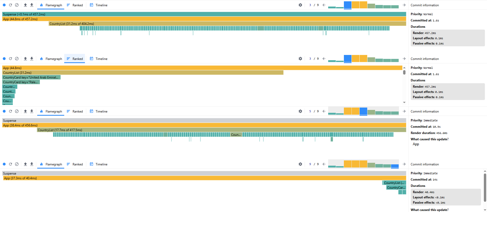
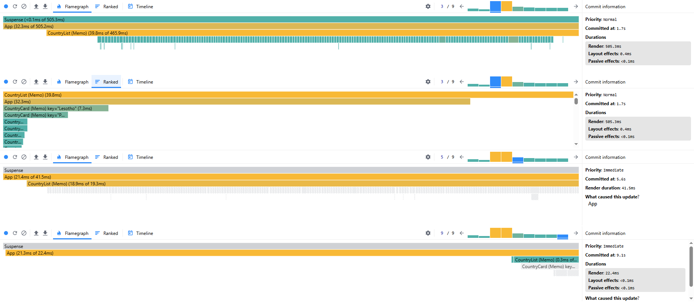

# **React Course Project (Rolling Scopes School)**

## **Project Overview**

This educational project, developed as part of the **React course at Rolling Scopes School**, demonstrates modern frontend development. The project showcases:

- ⚡ **Vite** – Next-generation frontend build tool for fast development
- 🎨 **Tailwind CSS** – Utility-first CSS framework for responsive styling
- 🧪 **Vitest** – Blazing fast unit test framework with React Testing Library
- 🧹 **ESLint** + **Prettier** – Code quality and formatting
- 🐶 **Husky** – Git hooks for pre-commit checks

## **How to Run the Project?**

### **Install dependencies**

```bash
npm install
```

### **Development server**

```bash
npm run dev
```

### **Production build**

```bash
npm run build
```

### **Testing**

```bash
npm test
```

### **Performance Profiling**

The following images compare the React DevTools profiler results of the application before and after the optimization using `memo`, `useMemo`, and `useCallback`.

**Before Optimization:**

_Caption: A high number of unnecessary re-renders across the component tree, leading to slower interactions and wasted computational resources._

**After Optimization:**

_Caption: Significantly fewer re-renders. Components now only update when their specific props change, greatly improving runtime efficiency._

### Summary of the Changes

Following the React application optimization through the implementation of `memo`, `useMemo`, and `useCallback`, the initial bundle load time has slightly increased due to the added overhead of comparison functions. However, this initial cost is significantly outweighed by the substantial performance gains during runtime. Subsequent user interactions, such as filtering lists, typing in inputs, and navigating between views, are now noticeably faster and smoother, as unnecessary re-renders are effectively prevented, leading to a more responsive and efficient user experience overall.
